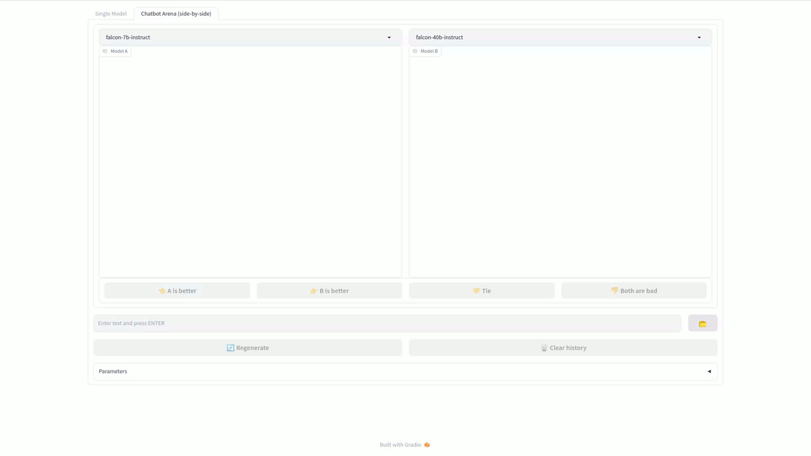
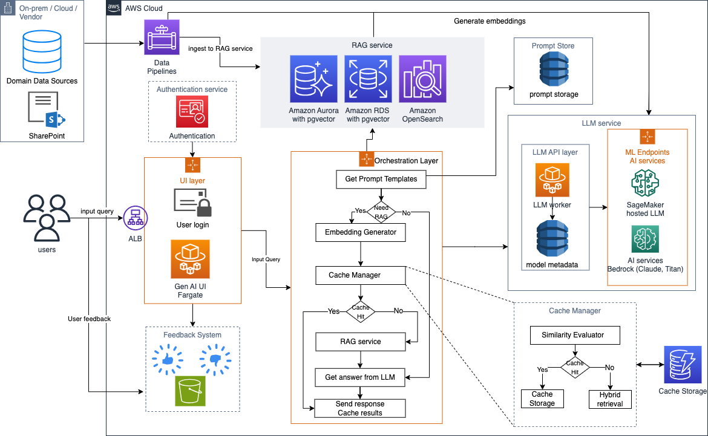

# sagemaker-fastchat
FastChat based chat agent powered by SageMaker real-time Inference


## Architecture


The Solution Architecture is made up of the following main components:
- Amazon VPC with private subnet.
- Amazon Elastic Container Registry (ECR) used to store fastchat service docker image.
- Amazon Elastic Container Serrvice (ECR) to host Serverless Fargate containers for fastchat service.
- Amazon DynamoDB to store SageMaker Endpoints information and configuration for fastchat service to access at runtime.
- Amazon SageMaker Endpoints used to host LLM models.

## Deploying new models
This solution has the ability use multiple LLM models at the same time. Currently all models must be hosted on SageMaker real-time endpoint that can produce streaming response. You can use any docker image of your choice to host the model on SageMaker.

The DynamoDB table should:
- have partition key of type `String` and called `model_name`.
- For each SageMaker endpoint there should be one record in the following format:

| Attribute name | Value |
| -------------- | ----- |
| `model_name` | `<name of model that will appear on fashcat web UI>` |
| `endpoint_name` | `<SageMaker real-time inference endpoint name (must be in sage region where the solution is deployed>` |
| `endpoint_req_config` | `<Request and response configuration JSON>` |

- The table should have a special record that has contains the `model_name`s of all active models seperated by a comma in the below format:

| Attribute name | Value |
| -------------- | ----- |
| `model_name` | `all-models` |
| `model_names` | `<model_1>,<model_2>,<model_3>,...<model_n>` |

- `endpoint_req_config`  should have the below keys:
    - `request`: This is where you specify the request configuration that will be sent to your SageMaker Endpoint. It must have two sub attributes `defaults` where you provide a request example with all default values and `mapping` where you provide jsonpath mapping to each required value (see TGI example below)
    - `response`: This is where you specify the response configuration that will be recieved from your SageMaker Endpoint. I must have two sub attributes `regex_sub` where you provide a regix string used to substitute the response text to make sure it is in JSON format. The second response attribute is`mapping` where you provide jsonpath mapping to each required value (see TGI example below)
 
Below is an example that is valid for SageMaker TGI deep learning containers

```
{
    "request": {
        "defaults": {
            "inputs": "My name is Olivier and I",
            "parameters": {
                "best_of": null,
                "decoder_input_details": false,
                "details": true,
                "do_sample": false,
                "max_new_tokens": 20,
                "repetition_penalty": null,
                "return_full_text": null,
                "seed": null,
                "stop": [
                  "photographer"
                ],
                "temperature": null,
                "top_k": null,
                "top_p": null,
                "truncate": null,
                "typical_p": null,
                "watermark": false
            },
            "stream": true
        },
        "mapping": {
            "prompt": "$.inputs",
            "stream": "$.stream",
            "max_new_tokens": "$.parameters.max_new_tokens",
            "repetition_penalty": "$.parameters.repetition_penalty",
            "return_full_text": "$.parameters.return_full_text",
            "temperature": "$.parameters.temperature",
            "top_p": "$.parameters.top_p",
            "top_k": "$.parameters.top_k",
            "stop": "$.parameters.stop",
            "best_of": "$.parameters.best_of",
            "decoder_input_details": "$.parameters.decoder_input_details",
            "details": "$.parameters.details",
            "do_sample": "$.parameters.do_sample",
            "seed": "$.parameters.seed",
            "truncate": "$.parameters.truncate",
            "typical_p": "$.parameters.typical_p",
            "watermark": "$.parameters.watermark"
        }
    },
    "response": {
        "regex_sub": "^data:",
        "mapping": {
            "text": "$.token.text",
            "logprobs": "$.token.logprob",
            "finish_reason": "$.details.finish_reason",
            "generated_tokens": "$.details.generated_tokens",
            "seed": "$.details.seed",
            "generated_text": "$.generated_text",
            "id": "$.token.id",
            "special": "$.token.special"
        }
    }
}
```

## CloudFormation Template
The CloudFormation templates can be used to provision the solution VPC, Build ECR images, ECS resources and provision SageMaker Endpoints. No templates are provided for DynamoDB table, AWS cognito Userpool, or Route 53.
To use CloudFormation templates follow the below steps (requires solution DynamoDB table to be provisioned in advance):
1. Build ECR Image:
    - Make sure your CodeBuild can access your github account (see [here](https://docs.aws.amazon.com/AWSCloudFormation/latest/UserGuide/aws-properties-codebuild-project-source.html))
        > For source code in a GitHub repository, the HTTPS clone URL to the repository that contains the source and the buildspec file. You must connect your AWS account to your GitHub account. Use the AWS CodeBuild console to start creating a build project. When you use the console to connect (or reconnect) with GitHub, on the GitHub Authorize application page, for Organization access, choose Request access next to each repository you want to allow AWS CodeBuild to have access to, and then choose Authorize application. (After you have connected to your GitHub account, you do not need to finish creating the build project. You can leave the AWS CodeBuild console.) To instruct AWS CodeBuild to use this connection, in the source object, set the auth object's type value to OAUTH.

    - Launch a stack from [image template](CloudFormation/image-template.yaml). This stack will build docker image that will be used in the solution. Make sure to check ECR to see the image is uploaded. It can take a while to build and upload the image to ECR after the stack has been deployed.
2. Setup solution VPC and deploy ECR (Fargate) resources:
    - Launch solution stack from [root template](CloudFormation/root-template.yaml). This will do the below:
        a. Deploy your VPC from [VPC template](CloudFormation/vpc-template.yaml) which creates two public subnets and two private subnets with a single NAT gateway for internet access.
        b. Deploy Fastchat service on Fargate using [fastchat template](CloudFormation/fastchat-template.yaml) which will create security groups for Fastchat service and ALB. It will also create Execution role and Task role used by Fargate on all services.
3. Deploy SageMaker Endpoints:
   - This step can be done before or after setp 3. Launch as many SageMaker endpoints as needed. You can use [SageMaker template](CloudFormation/sagemaker-template.yaml) for that as well.
   - Update your DynamoDB table with endpoint information and request configuration

## Security

See [CONTRIBUTING](CONTRIBUTING.md#security-issue-notifications) for more information.

## License

This library is licensed under the MIT-0 License. See the LICENSE file.

